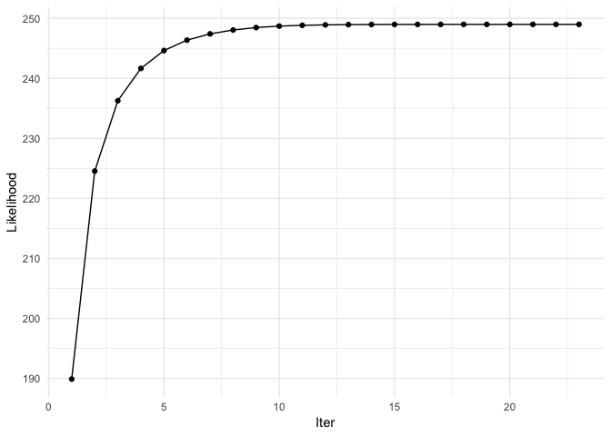

<!-- README.md is generated from README.Rmd. Please edit that file -->
EMtree
======

[](https://travis-ci.org/Rmomal/EMtree) [](https://codecov.io/gh/Rmomal/EMtree?branch=master)

> EMtree infers interaction networks from abundance data. It uses averages over spanning trees within a Poisson log-Normal Model ([PLNmodels](https://github.com/jchiquet/PLNmodels%3E)), and involves plotting funcitonalities (using `ggraph` and `tydigraph`).

Installation
------------

You can install the development version of EMtree:

``` r
devtools::install_github("Rmomal/EMtree")
```

Example with Fatala river fishes
--------------------------------

This is a basic example which shows you how to infer a network, using Barans95 data from the `ade4` package.

### Data

``` r
library(ade4)
library(tidyverse)
data(baran95)
counts = as.matrix(baran95$fau)
covar = as_tibble(baran95$plan)

n = nrow(counts)
p = ncol(counts)
```

``` r
head(counts)
#>   AMA CAS CHI CHL CJO CST CTR CWA CYS DAF EFI ELA GDE GME HFA HFO IAF LFA
#> 1   0   2   0   3   0   0   0   0   0   0  71   1   5   6   0   0   7   3
#> 2   0   1   0   0   0   0   0   0   0   0 118   2   3   0   0   0   8   1
#> 3   0   2   0   3   0   0   0   0   0   0  69   0   6   2   0   0   8   3
#> 4   0   0   0   2   0   0   0   0   0   0  56   0   0   0   0   0   1   0
#> 5   0   0   0   0   0   0   0   0   3   0   0   1   1   0   0   0   2   2
#> 6   0   0   0   0   0   0   0   0   5   0   0   0   2   0   0   0   0   0
#>   LGR LNI PAA PBR PEL PJU PLE PMO POQ PPA PQQ PTY SEB TIN TLE
#> 1   3   0   0   5   2   9  26   0   4   0   0   0  22   0   2
#> 2   7   0   0   0   0   0 113   0   1   0   0   1  18   0   1
#> 3   0   0   0   1   0   3   0   0   1   0   0   0   3   0   0
#> 4   2   0   0   0   0   0   0   0   0   0   0   0  15   0   0
#> 5   5   0   0   0   3   0   0   0   4   0   0   3   0   0   0
#> 6   9   0   0   2   4   4   0   2   0   0   0   1   0   0   0
head(covar)
#> # A tibble: 6 x 2
#>   date  site 
#>   <fct> <fct>
#> 1 apr93 km03 
#> 2 apr93 km03 
#> 3 apr93 km03 
#> 4 apr93 km03 
#> 5 apr93 km17 
#> 6 apr93 km17
```

### Fit PLN model

This creates a `PLNmodels` object

``` r
library(PLNmodels)
model<-PLN(counts ~ covar$site)
#> 
#>  Initialization...
#>  Adjusting a PLN model with full covariance model
#>  Post-treatments...
#>  DONE!
```

### Run EMtree function

``` r
library(EMtree)
set.seed(3)
output<-EMtree(model,  maxIter = 10, plot=TRUE)
#> [1] 0.7157895
#> 
#> Likelihoods: 81.60106 , 81.68395 , 81.684 ,
```



    #> 
    #> Convergence took 0.75 secs  and  3  iterations.
    #> Likelihood difference = 5.399854e-05 
    #> Betas difference = 2.305752e-09
    str(output)
    #> List of 6
    #>  $ beta     : num [1:33, 1:33] 0 0.000946 0.000946 0.000947 0.000946 ...
    #>  $ logpY    : num [1:3] 81.6 81.7 81.7
    #>  $ ProbaCond: num [1:33, 1:33] 0.00 6.78e-05 3.17e-03 7.09e-02 2.84e-03 ...
    #>  $ maxIter  : num 3
    #>  $ timeEM   : 'difftime' num 0.751084089279175
    #>   ..- attr(*, "units")= chr "secs"
    #>  $ alpha    : num 0.716

### Foster robustness with resampling :

``` r
library(parallel)
resample_output<-ResampleEMtree(counts=counts, vec_covar="covar$site", S=5, maxIter=10,cond.tol=1e-8, cores=1)
#> 
#> S= 1  [1] 0.7236842
#> 
#> Convergence took 0.2 secs  and  4  iterations.  0.7236842
#> S= 2  [1] 0.7894737
#> 
#> Convergence took 0.14 secs  and  3  iterations.  0.7894737
#> S= 3  [1] 0.6973684
#> 
#> Convergence took 0.39 secs  and  10  iterations.  0.6973684
#> S= 4  [1] 0.7894737
#> 
#> Convergence took 0.19 secs  and  4  iterations.  0.7894737
#> S= 5  [1] 0.8815789
#> 
#> Convergence took 0.35 secs  and  8  iterations.  0.8815789
str(resample_output)
#> List of 3
#>  $ Pmat   : num [1:5, 1:528] 3.76e-03 1.58e-03 4.14e-04 4.88e-05 2.48e-05 ...
#>  $ maxIter: num [1:5] 4 3 10 4 8
#>  $ times  : 'difftime' num [1:5] 0.200549840927124 0.141237020492554 0.38936710357666 0.188949108123779 ...
#>   ..- attr(*, "units")= chr "secs"
```

### Several models with resampling :

``` r
library(parallel)
compare_output<-ComparEMtree(counts, vec_covar=c("covar$site","covar$date"), S=1, maxIter=5,cond.tol=1e-8,cores=1,f=0.8)
#> 
#> model  null : 
#> 
#> S= 1  [1] 0.3289474
#> 
#> Convergence took 0.15 secs  and  3  iterations.  0.3289474
#> model  site : 
#> 
#> S= 1  [1] 0.7236842
#> 
#> Convergence took 0.3 secs  and  4  iterations.  0.7236842
#> model  date : 
#> 
#> S= 1  [1] 0.2894737
#> 
#> Convergence took 0.31 secs  and  5  iterations.  0.2894737
#> model  site + date : 
#> 
#> S= 1  [1] 0.9605263
#> 
#> Convergence took 0.19 secs  and  4  iterations.  0.9605263


str(compare_output)
#> Classes 'tbl_df', 'tbl' and 'data.frame':    4356 obs. of  4 variables:
#>  $ key    : chr  "1" "1" "1" "1" ...
#>  $ rowname: chr  "1" "2" "3" "4" ...
#>  $ models : chr  "null" "null" "null" "null" ...
#>  $ value  : num  0 0 0 0 0 0 0 0 0 0 ...
```

### Graphics

#### From `EMtree` output

Simple network:

``` r
library(ggraph)
library(tidygraph)
library(viridis)

set.seed(200)
x<- 1*(output$ProbaCond>2/p)
draw_network(x,"Site", pal="dodgerblue3")
```


#### From `ResampleEMtree` output

``` r
f<-0.8
df<-freq_selec(resample_output$Pmat,p=p,f=f)
draw_network(df,"Site")
```


#### Facet for plotting several models in one shot

``` r
compar_graphs(compare_output,alpha=TRUE)
#> Using `nicely` as default layout
```


