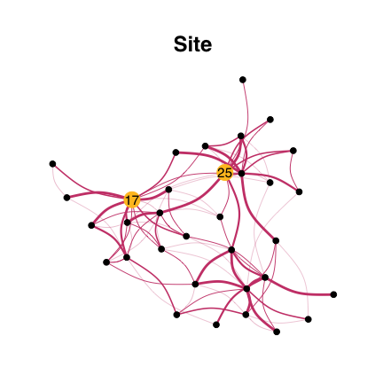

<!-- README.md is generated from README.Rmd. Please edit that file -->
EMtree
======

> EMtree infers interaction networks from abundance data. It uses averages over spanning trees within a Poisson log-Normal Model ([PLNmodels](https://github.com/jchiquet/PLNmodels%3E)), and involves plotting funcitonalities (using `ggraph` and `tydigraph`).

Installation
------------

You can install the development version of EMtree with:

``` r
devtools::install_github("Rmomal/EMtree")
```

Example with Fatala river fishes
--------------------------------

This is a basic example which shows you how to infer a network, using Barans95 data from the `ade4` package.

### Data

``` r
library(ade4)
library(tidyverse)
data(baran95)
counts = as.matrix(baran95$fau)
covar = as_tibble(baran95$plan)

n = nrow(counts)
p = ncol(counts)
```

``` r
head(counts)
#>   AMA CAS CHI CHL CJO CST CTR CWA CYS DAF EFI ELA GDE GME HFA HFO IAF LFA
#> 1   0   2   0   3   0   0   0   0   0   0  71   1   5   6   0   0   7   3
#> 2   0   1   0   0   0   0   0   0   0   0 118   2   3   0   0   0   8   1
#> 3   0   2   0   3   0   0   0   0   0   0  69   0   6   2   0   0   8   3
#> 4   0   0   0   2   0   0   0   0   0   0  56   0   0   0   0   0   1   0
#> 5   0   0   0   0   0   0   0   0   3   0   0   1   1   0   0   0   2   2
#> 6   0   0   0   0   0   0   0   0   5   0   0   0   2   0   0   0   0   0
#>   LGR LNI PAA PBR PEL PJU PLE PMO POQ PPA PQQ PTY SEB TIN TLE
#> 1   3   0   0   5   2   9  26   0   4   0   0   0  22   0   2
#> 2   7   0   0   0   0   0 113   0   1   0   0   1  18   0   1
#> 3   0   0   0   1   0   3   0   0   1   0   0   0   3   0   0
#> 4   2   0   0   0   0   0   0   0   0   0   0   0  15   0   0
#> 5   5   0   0   0   3   0   0   0   4   0   0   3   0   0   0
#> 6   9   0   0   2   4   4   0   2   0   0   0   1   0   0   0
head(covar)
#> # A tibble: 6 x 2
#>   date  site 
#>   <fct> <fct>
#> 1 apr93 km03 
#> 2 apr93 km03 
#> 3 apr93 km03 
#> 4 apr93 km03 
#> 5 apr93 km17 
#> 6 apr93 km17
```

### Fit PLN model

This creates a `PLNmodels` object

``` r
library(PLNmodels)
model<-PLN(counts ~ covar$site)
#> 
#>  Initialization...
#>  Adjusting PLN model with full covariance model
#>  Computing (pseudo) R2
#>  DONE!
```

### Run EMtree function

``` r
library(EMtree)
output<-EMtree(model,  maxIter = 5)
#> [1] "Convergence took3.53secs and 5 iterations.\nLikelihood difference =0.455230246616992\nBetas difference =6.21312284573617e-07"
#> [1] "Convergence took2.77secs and 5 iterations.\nLikelihood difference =0.699806581683276\nBetas difference =8.75130415739247e-06"
str(output)
#> List of 5
#>  $ beta     : num [1:33, 1:33] 0 0.000406 0.00035 0.000899 0.000418 ...
#>  $ logpY    : num [1:5] 163 185 189 190 191
#>  $ ProbaCond: num [1:33, 1:33] 0.00 1.88e-06 1.54e-04 1.89e-02 1.15e-04 ...
#>  $ beta     : num [1:33, 1:33] 0.00 1.29e-05 6.20e-05 1.09e-03 5.32e-05 ...
#>  $ logpY    : num [1:5] 132 151 152 153 154
#>  $ ProbaCond: num [1:33, 1:33] 0.00 3.48e-07 8.09e-05 3.43e-02 4.28e-05 ...
#>  $ maxIter  : num 5
#>  $ times    : 'difftime' num 3.53110122680664
#>  $ times    : 'difftime' num 2.77224802970886
#>   ..- attr(*, "units")= chr "secs"
```

### Foster robustness with resampling :

``` r
library(parallel)
resample_output<-ResampleEMtree(counts, "covar$site", B=2, maxIter=2,cond.tol=1e-8, cores=1)
str(resample_output)
#> List of 3
#>  $ Pmat   : num [1:2, 1:528] 4.74e-05 4.58e-04 4.59e-03 1.54e-02 3.87e-02 ...
#>  $ maxIter: num [1:2] 2 2
#>  $ times  : 'difftime' num [1:2] 1.11130309104919 0.167003154754639
#>   ..- attr(*, "units")= chr "secs"
```

### Several models with resampling :

``` r
library(parallel)
compare_output<-ComparEMtree(counts, c("covar$site","covar$date"), B=2, maxIter=2,cond.tol=1e-8, cores=1,
                             f=0.8,seed=1)
str(compare_output)
#> Classes 'tbl_df', 'tbl' and 'data.frame':    4356 obs. of  4 variables:
#>  $ key    : chr  "1" "1" "1" "1" ...
#>  $ rowname: chr  "1" "2" "3" "4" ...
#>  $ models : chr  "null" "null" "null" "null" ...
#>  $ value  : num  0 0 0 0 0 0 0 0 0 0 ...
```

### Graphics

#### From `EMtree` output

Simple network:

``` r
library(ggraph)
library(tidygraph)
#> 
#> Attaching package: 'tidygraph'
#> The following object is masked from 'package:stats':
#> 
#>     filter
library(viridis)
#> Loading required package: viridisLite
seed<-200

x<- 1*(output$ProbaCond>2/p)
draw_network(x,"Site", pal="dodgerblue3")
```


#### From `ResampleEMtree` output

``` r
f<-0.8
df<-freq_selec(resample_output$Pmat,p=p,f=f)
draw_network(df,"Site")
```



#### Facet for plotting several models in one shot

``` r
compar_graphs(compare_output,alpha=TRUE)
#> Using `nicely` as default layout
```


