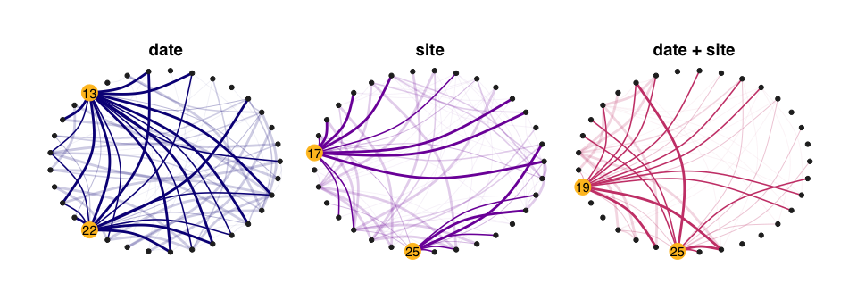

<!-- README.md is generated from README.Rmd. Please edit that file -->
EMtree
======

> EMtree infers interaction networks from abundance data. It uses averages over spanning trees within a Poisson log-Normal Model ([PLNmodels](https://github.com/jchiquet/PLNmodels%3E)), and involves plotting funcitonalities (using `ggraph` and `tydigraph`).

Installation
------------

You can install the development version of EMtree:

``` r
devtools::install_github("Rmomal/EMtree")
```

Example with Fatala river fishes
--------------------------------

This is a basic example which shows you how to infer a network, using Barans95 data from the `ade4` package.

### Data

``` r
library(ade4)
library(tidyverse)
data(baran95)
counts = as.matrix(baran95$fau)
covar = as_tibble(baran95$plan)

n = nrow(counts)
p = ncol(counts)
```

``` r
head(counts)
#>   AMA CAS CHI CHL CJO CST CTR CWA CYS DAF EFI ELA GDE GME HFA HFO IAF LFA
#> 1   0   2   0   3   0   0   0   0   0   0  71   1   5   6   0   0   7   3
#> 2   0   1   0   0   0   0   0   0   0   0 118   2   3   0   0   0   8   1
#> 3   0   2   0   3   0   0   0   0   0   0  69   0   6   2   0   0   8   3
#> 4   0   0   0   2   0   0   0   0   0   0  56   0   0   0   0   0   1   0
#> 5   0   0   0   0   0   0   0   0   3   0   0   1   1   0   0   0   2   2
#> 6   0   0   0   0   0   0   0   0   5   0   0   0   2   0   0   0   0   0
#>   LGR LNI PAA PBR PEL PJU PLE PMO POQ PPA PQQ PTY SEB TIN TLE
#> 1   3   0   0   5   2   9  26   0   4   0   0   0  22   0   2
#> 2   7   0   0   0   0   0 113   0   1   0   0   1  18   0   1
#> 3   0   0   0   1   0   3   0   0   1   0   0   0   3   0   0
#> 4   2   0   0   0   0   0   0   0   0   0   0   0  15   0   0
#> 5   5   0   0   0   3   0   0   0   4   0   0   3   0   0   0
#> 6   9   0   0   2   4   4   0   2   0   0   0   1   0   0   0
head(covar)
#> # A tibble: 6 x 2
#>   date  site 
#>   <fct> <fct>
#> 1 apr93 km03 
#> 2 apr93 km03 
#> 3 apr93 km03 
#> 4 apr93 km03 
#> 5 apr93 km17 
#> 6 apr93 km17
```

### Fit PLN model

This creates a `PLNmodels` object

``` r
library(PLNmodels)
model<-PLN(counts ~ covar$site)
#> 
#>  Initialization...
#>  Adjusting PLN model with full covariance model
#>  Computing (pseudo) R2
#>  DONE!
```

### Run EMtree function

``` r
library(EMtree)
set.seed(3)
output<-EMtree(model,  maxIter = 40, plot=TRUE)
#> 
#> Likelihoods: 109.3301 , 152.0645 , 167.3161 , 174.6878 , 178.8627 , 181.5125 , 183.2325 , 184.3332 , 185.0525 , 185.5438 , 185.8848 , 186.1163 , 186.2671 , 186.3619 , 186.42 , 186.4551 , 186.4761 , 186.4886 , 186.4961 , 186.5006 , 186.5034 , 186.505 , 186.506 , 186.5066 , 186.507 , 186.5073 , 186.5074 , 186.5075 , 
#> Convergence took 1.22 secs  and  28  iterations.
#> Likelihood difference = 9.499981e-05 
#> Betas difference = 8.979049e-08
```


``` r
str(output)
#> List of 5
#>  $ beta     : num [1:33, 1:33] 0.00 6.84e-13 3.54e-13 1.01e-12 7.81e-13 ...
#>  $ logpY    : num [1:28] 109 152 167 175 179 ...
#>  $ ProbaCond: num [1:33, 1:33] 0e+00 1e-10 1e-10 1e-10 1e-10 ...
#>  $ maxIter  : num 28
#>  $ times    : 'difftime' num 1.22025990486145
#>   ..- attr(*, "units")= chr "secs"
```

### Foster robustness with resampling :

``` r
library(parallel)
resample_output<-ResampleEMtree(counts, "covar$site", B=5, maxIter=5,cond.tol=1e-8, cores=1)
#> 
#> Likelihoods: 78.48024 , 123.384 , 144.3605 , 154.5522 , 159.6641 , 
#> Likelihoods: 103.7052 , 143.6617 , 161.0594 , 170.2559 , 175.5966 , 
#> Likelihoods: 107.3559 , 149.5836 , 163.0476 , 169.7796 , 173.6702 , 
#> Likelihoods: 167.2153 , 205.859 , 215.4294 , 218.96 , 220.7505 , 
#> Likelihoods: 181.1704 , 217.3531 , 227.3924 , 231.8483 , 234.5019 ,
str(resample_output)
#> List of 3
#>  $ Pmat   : num [1:5, 1:528] 1e-10 1e-10 1e-10 1e-10 1e-10 ...
#>  $ maxIter: num [1:5] 5 5 5 5 5
#>  $ times  : 'difftime' num [1:5] 0.158960103988647 0.135524988174438 0.140005111694336 0.134567022323608 ...
#>   ..- attr(*, "units")= chr "secs"
```

### Several models with resampling :

``` r
library(parallel)
compare_output<-ComparEMtree(counts, c("covar$site","covar$date"), B=5, maxIter=5,cond.tol=1e-8,cores=1,f=0.8)
#> 
#> model  null : 
#> 
#> Likelihoods: 77.31238 , 122.5155 , 142.6743 , 152.8868 , 158.6385 , 
#> Likelihoods: 91.34377 , 137.6196 , 156.499 , 165.69 , 170.6155 , 
#> Likelihoods: 77.25181 , 114.6341 , 134.141 , 145.9347 , 153.5409 , 
#> Likelihoods: 41.06019 , 80.82301 , 102.9818 , 116.2524 , 124.3348 , 
#> Likelihoods: 45.70308 , 87.79204 , 108.2152 , 119.2203 , 125.8633 , 
#> model  site : 
#> 
#> Likelihoods: 78.50402 , 123.4167 , 144.4204 , 154.6312 , 159.7477 , 
#> Likelihoods: 103.7131 , 143.6475 , 161.0072 , 170.1482 , 175.456 , 
#> Likelihoods: 112.2026 , 153.8223 , 167.0465 , 173.6427 , 177.4473 , 
#> Likelihoods: 167.1091 , 205.7722 , 215.345 , 218.8668 , 220.6371 , 
#> Likelihoods: 181.4295 , 217.5544 , 227.4881 , 231.8831 , 234.5074 , 
#> model  date : 
#> 
#> Likelihoods: 77.40256 , 129.0996 , 149.0478 , 158.0193 , 162.8702 , 
#> Likelihoods: 58.80977 , 109.624 , 132.5651 , 143.6882 , 149.489 , 
#> Likelihoods: 78.32108 , 120.6588 , 138.3027 , 147.4406 , 153.017 , 
#> Likelihoods: 79.23742 , 124.471 , 143.8779 , 154.7686 , 161.6351 , 
#> Likelihoods: 73.08856 , 117.8739 , 138.7901 , 149.7477 , 156.4177 , 
#> model  site + date : 
#> 
#> Likelihoods: 25.19086 , 68.93343 , 84.32232 , 91.6614 , 96.20416 , 
#> Likelihoods: -11.14859 , 20.14299 , 35.6732 , 46.67831 , 54.2789 , 
#> Likelihoods: 3.991895 , 31.00873 , 46.13567 , 57.61898 , 65.82475 , 
#> Likelihoods: -0.9983228 , 34.5101 , 54.47442 , 65.84457 , 72.46498 , 
#> Likelihoods: 20.15598 , 57.0857 , 74.39359 , 84.38397 , 90.25653 ,


str(compare_output)
#> Classes 'tbl_df', 'tbl' and 'data.frame':    4356 obs. of  4 variables:
#>  $ key    : chr  "1" "1" "1" "1" ...
#>  $ rowname: chr  "1" "2" "3" "4" ...
#>  $ models : chr  "null" "null" "null" "null" ...
#>  $ value  : num  0 0 0 0 0 0 0 0 0 0 ...
```

### Graphics

#### From `EMtree` output

Simple network:

``` r
library(ggraph)
library(tidygraph)
library(viridis)


x<- 1*(output$ProbaCond>2/p)
draw_network(x,"Site", pal="dodgerblue3")
```


#### From `ResampleEMtree` output

``` r

f<-0.8
df<-freq_selec(resample_output$Pmat,p=p,f=f)
draw_network(df,"Site")
```


#### Facet for plotting several models in one shot

``` r

compar_graphs(compare_output,alpha=TRUE)
#> Using `nicely` as default layout
```


